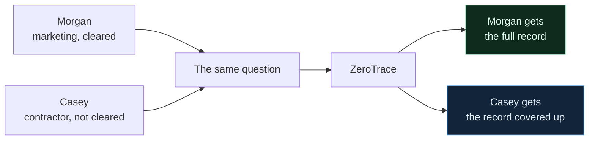
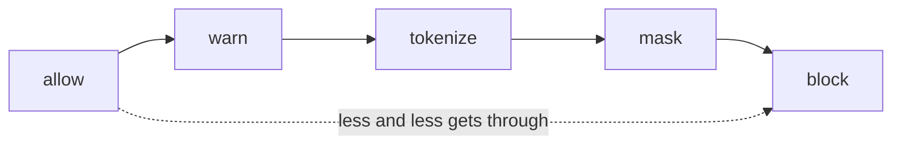
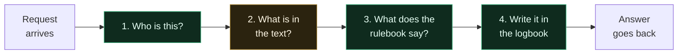
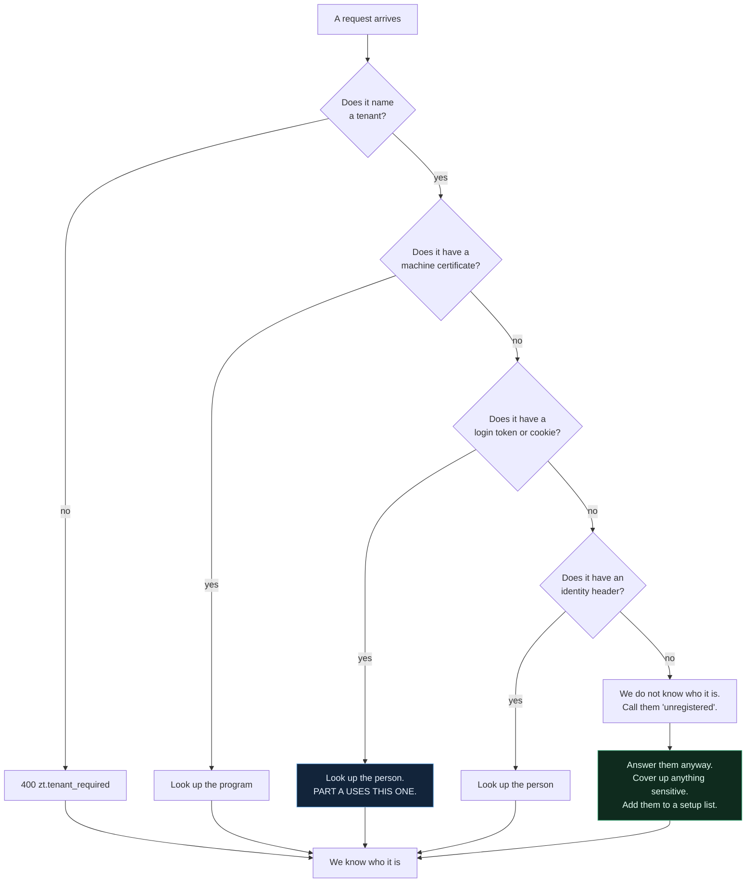
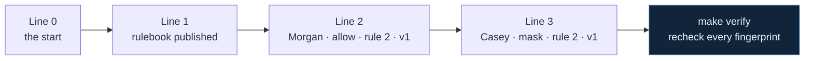
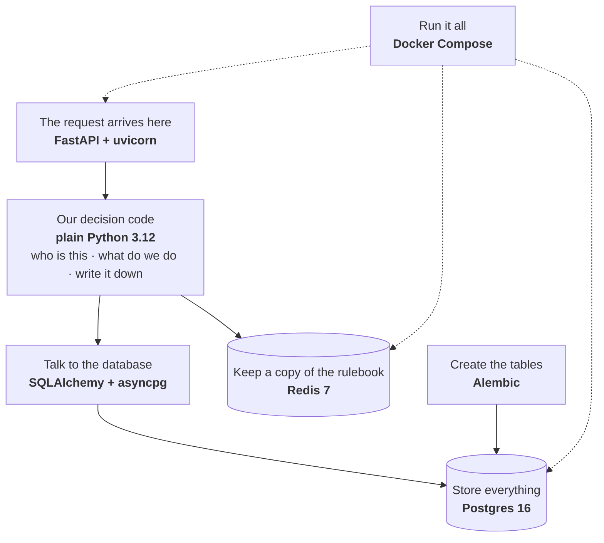
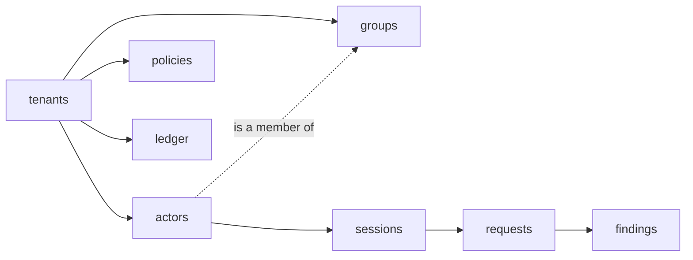
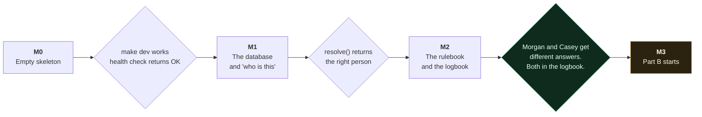

# Part A — What We Are Building, In Plain Words

**Branch:** `PA` · **Milestones:** M0, M1, M2

---

## 1. The whole idea, in one example

Two people work at a technology company called **Acme Technologies** (`acme-tech`).

- **Morgan** is in the marketing department and is cleared for customer PII.
- **Casey** is a contractor and is not cleared for anything.

Both of them open Claude. Both type **exactly the same thing**:

> *"Show me the customer record for Jordan Example."*

Claude looks in the company's document store. It finds the record. It writes an answer.

**Right now, both people get the same answer.** That is the problem.

**After Part A, they get different answers:**

| | What Morgan sees | What Casey sees |
|---|---|---|
| | Jordan Example | jordan.example@invalid.example | +1-202-555-0104 | ██████ Example | ██████████@████████.████████ | ████████████████ |

Nobody changed the question. Nobody changed the document store. The only difference is **who
asked**.



**That is all of Part A.** Everything below is how we make that happen.

---

## 2. Why this matters

Claude can find the record. That is a search problem, and search already works.

But **finding a record is not the same as being allowed to read it.**

Casey can ask Claude for a customer record and get one. Casey never opened the CRM. Casey
never asked for access. Casey just asked a chatbot a question.

Part A puts the permission check back in.

---

## 3. Five words you need

We use these five words everywhere. Nothing else is special.

| Word | What it means | In our example |
|---|---|---|
| **Tenant** | A company, or a department under it. | `acme-tech`, with four department tenants underneath it. |
| **Actor** | One person or one program that sends a request. | Morgan. Casey. The build bot. |
| **Group** | A named set of people. | `customer_pii_access` — Morgan is in it, Casey is not. |
| **Policy** | The rulebook. One file per company. | "Cover customer PII, unless the person is cleared for it." |
| **Ledger** | The logbook. Once we write a line, nobody can change it. | "Casey. Covered up. Rule 2. Rulebook version 1." |

A group is a **row in a table**, not a word written in the code. So an administrator can add
a new group without a new build.

---

## 4. The five things we can do to text

The system has exactly five actions. Here is what each one does to an API key.

| Action | What the other side receives |
|---|---|
| **allow** | `sk-ant-api03-9fK2xR...` — untouched |
| **warn** | `sk-ant-api03-9fK2xR...` — untouched, but we write a warning |
| **tokenize** | `sk-ant-api03-7bQ8mT...` — a fake key, same shape, real one is gone |
| **mask** | `████████████████████` |
| **block** | nothing. The message never goes. |

They are in order. `allow` lets through the most. `block` lets through the least.



Remember this order. Section 8 uses it.

---

## 5. What happens to one request, start to finish

Four steps. That is the whole system.



Green = **we build it in Part A.**
Yellow = Part B builds it later. In Part A it is an empty box that returns nothing.

Now each step in detail.

---

First it resolves the **tenant**. In production and demo, every request must name one with
`X-ZeroTrace-Tenant`. No name → `400 zt.tenant_required`. Unknown name → `404
zt.tenant_unknown`. Only `dev` falls back to a default tenant.

Then it tries to identify the actor, in order, and stops at the first thing that works.
Each rung tries the caller's own tenant first, then the root organisation (an
organisation-scoped actor such as the security admin or the executive can act for any
department under the root).



Once we know the actor, we know three things about them: their **role** (their job title),
their **groups**, and their **scope** (`tenant` or `organisation`). All come from the
company's own staff directory. We do not invent any of them.

A request may also name a prior session with `X-ZeroTrace-Session`; it must belong to the
same tenant and actor, or it is rejected. If bearer and cookie credentials are both present
and disagree, the request is rejected — we never silently pick one.

### Why we answer people we do not recognise

Refusing them looks safer. It is not.

If we refuse Casey, Casey's tool stops working. Casey still has a job to do. So Casey finds
a way around us — a personal account, a phone, anything. Now we cannot see Casey at all.

So we answer. We cover up anything sensitive. And we put Casey on a list so somebody can set
them up properly.

**A person going around us is the exact failure we exist to stop.**

### One weakness we say out loud

The header rung trusts a header. Somebody could fake that header.

We do not hide this. It goes in the README, in the scope notes, and in the demo — **in the

---

## 7. Step 2 — What is in the text?

This is Part B's job. Part B reads the text and reports what it found.

One report is called a **finding**. A finding says two things:

- **What kind** of sensitive thing it is. Example: `CUSTOMER_PII`, `SOURCE_SECRET`, `API_KEY`.
- **Where** it is in the message. Example: `messages[2].content`.

**A finding never holds the actual text.** If it held the credit card number, then our own
database would hold the secret — which is the thing we are trying to stop.

In Part A this step is an empty box. It returns nothing. The test in section 12 writes the
finding by hand.

---

## 8. Step 3 — What does the rulebook say?

### 8.1 The rulebook

One file per company. Five org rules plus one child policy for the security department —
`policies/acme-tech.yaml` and `policies/acme-tech-security.yaml`. Together they show the
whole idea:

```yaml
version: 1
org: acme-tech
mode: enforce            # root policy owns mode; children omit it
default: allow
unregistered_workload: mask
fail: closed             # Part A fixes fail: closed

rules:
  # Rule 0 — a credential or a source secret must never leave.
  - match: { direction: outbound, class: [API_KEY, PRIVATE_KEY, JWT, DB_URI, SOURCE_SECRET] }
    action: block

  # Rule 1 — customer/employee PII and financial records leave only as a token.
  #          Part A cannot honour tokenize yet: the vault is Part B, so redact.py
  #          applies mask and reports tokenize_needs_vault. It never fakes a token.
  - match: { direction: outbound, class: [CUSTOMER_PII, EMPLOYEE_PII, FINANCIAL_RECORD] }
    action: tokenize

  # Rule 2 — THIS IS THE PART A RULE.
  #          Customer PII coming back from the model is masked unless the person
  #          asking is cleared for it. Retrieval is not access control.
  - match: { direction: inbound, class: [CUSTOMER_PII] }
    action: mask
    unless:
      - actor_group: [customer_pii_access]
      - actor_role: [executive]       # organisation-scoped executive exception

  # Rule 3 — employee PII, same shape, clearance group employee_pii_access.
  # Rule 4 — financial records, same shape, clearance group financial_record_access.
  # Rule 5 — source secrets never come back to anyone.
  - match: { direction: inbound, class: [SOURCE_SECRET] }
    action: block
```

**"outbound"** means text going **to** Claude. **"inbound"** means text coming **back** from
Claude.

Read rule 2 in English:

> Cover up customer PII coming back from Claude — **unless** the person asking is cleared
> for it.

Morgan is in `customer_pii_access`, so the `unless` applies and Morgan sees the record.
Casey is not, so the rule applies and Casey's copy is covered. The security child policy
raises rules 2–4 from `mask` to `block` and keeps source secrets blocked; only the executive
role has an exception there.

Rules 0 and 1 are written now. They start working at M3, when Part B can find keys and
personal data.

### 8.2 How we work out the answer

Six steps, in this order:

1. Start with the default action.
2. Go through the **company** rules, top to bottom. The last rule that matches wins.
3. Go through the **business unit** rules the same way. Then apply the rule in 8.3.
4. Apply `unless` (for inbound) or `except` (for outbound). **These are the only things that
   can make an action weaker.** We write down every time we use one.
5. Apply any approved one-off exception for this person. Part A has none set up.
6. If a rule asks for a human to review it, mark it. Part A does not have that stage yet.

The answer we produce is called a **Decision**. It holds the **action**, the **rule
number**, the **org rulebook version**, and — when a business-unit rule wins — the **BU
rulebook version**.

### Why we keep the rule number and the version

"We covered it up" is not a good enough answer when somebody asks why.

"Rule 2 of rulebook version 1 covered it up" is. Somebody can open version 1, read line 2,
and see the reason for themselves.

### 8.3 A business unit can only make a rule stronger

A company sets rules. A business unit inside the company can also set rules.

> **A business unit can move an action further right on the ladder. Never further left.**

The company says `mask` customer PII.

- The `security` unit changes it to `block`. That is stronger. **We accept it.**
- The `security` unit changes it to `allow`. That is weaker. **We refuse it.**

We refuse it **when somebody saves the rulebook**, not later when a request arrives. The
error message quotes the exact rule that is wrong. The administrator fixes it before it goes
live.

This is about eight lines of code. It is also most of what people mean by "enterprise
policy".

---

## 9. Step 4 — Write it in the logbook

We have to prove what we decided. We also have to prove nobody edited it afterwards.

We do this by linking the lines together.

Each line gets a fingerprint. The fingerprint is made from **the line itself plus the
fingerprint of the line before it.**



Now say somebody edits line 2 to hide what happened to Morgan. Line 2's fingerprint changes.
Line 3 was built from the **old** fingerprint. So line 3 no longer matches. The edit shows up
immediately.

Four rules keep this working:

1. **Write the text the same way every time.** Sort the keys, no spaces, UTF-8, numbers as
   text. One function does this for all code. If two parts of the code write it differently,
   the fingerprints stop matching and the proof is worthless.
2. **Write the logbook line in the same database transaction as the request.** Lock the last
   line first. Otherwise two requests at once both think they are next in the chain.
3. **Never put sensitive text in a logbook line.** Class and location only.
4. **Never delete a line.** A delete breaks the chain.

Anybody can check the logbook themselves. `scripts/verify_ledger.py` takes one argument —
which company — and needs nothing else. It does not even need our server running. A judge can
run it against the database without our help.

Part A writes two kinds of line: `policy.updated` and `request.decided`.

---

## 10. What we build it with



| Tool | Its job |
|---|---|
| **Python 3.12** | The language. |
| **FastAPI + uvicorn** | Receives the request. |
| **pydantic** | Reads the rulebook file. **If the file has a word we do not recognise, we stop with an error.** A typo that silently does nothing is a security hole with a clean audit trail. |
| **PyYAML** | Reads the YAML. **Use `safe_load`. Never use `load`.** |
| **SQLAlchemy + asyncpg** | Reads and writes database rows. |
| **Postgres 16** | Keeps everything. It can lock a row, which the logbook needs. |
| **Redis 7** | In Part A it holds one thing: a copy of the current rulebook. We clear it when somebody publishes a new one. |
| **Alembic** | Creates and changes tables. One file per milestone. Never hand-typed SQL. |
| **hashlib** | Makes the fingerprints. Built into Python. |
| **structlog** | Writes logs, and strips sensitive text out of them. Build this at M0, not later. |
| **pytest** | Runs the tests. |
| **Docker Compose** | Everybody runs the same three containers. Nobody installs this on a laptop. |
| **`clock.now()`** | One function gives the time to all code. A test can freeze it. Never call `datetime.now()`. |

**Do not add these yet:** `google-re2`, spaCy, pyahocorasick, Razorpay, Envoy, Helm. They
belong to Part B and later. If one appears before M3, somebody started the wrong part.

---

## 11. What we store

Eight tables.

| Table | One row for each... |
|---|---|
| `tenants` | company, and each business unit inside it |
| `actors` | person or program — holds their role and their groups |
| `groups` | group name |
| `sessions` | connection from a person |
| `policies` | version of the rulebook — **we never edit an old row, we only add a new one** |
| `requests` | request we handled |
| `findings` | sensitive thing we found |
| `ledger` | logbook line |



We are building fewer columns than the full design has. That is on purpose:

| Table | Left out for now | Why that is fine |
|---|---|---|
| `tenants` | the billing columns | Part A has no billing. |
| `policies` | `created_by` | The logbook already records who published it. |
| `requests` | timing and risk score | Those need Part B. |
| `findings` | the review columns | Those need the review agent, which we are not building. |
| `ledger` | **nothing, ever** | Removing anything breaks the chain. |

Three things that must always be true:

1. **Every actor has an identity** — a login name, or a program identity, or both. Never
   neither. The database enforces this.
2. **There is no column for a developer's API key.** In this product a developer never holds
   one, so we never store one.
3. **`findings` holds the class and the location. Never the text.**

---

## 12. The plan

Three milestones. Each one ends with a command that fails loudly if the work is wrong. **Do
not start one before the one before it passes.**



### Part A is finished when this test passes

> Make two people. Put one in `customer_pii_access`. Do not put the other one in it.
> Send the **same** request for both.
> They get **different** answers.
> The logbook has a line for each, and each line says the action, the rule number and the
> policy version.

That test is the finish line. "The tables exist" is not the finish line. "The code looks
right" is not the finish line.

**The production gate is the completion command.** `make part-a-e2e` runs the same claim
over real HTTP with PostgreSQL 16 and Redis 7 — restart persistence, concurrent conditional
publishes, a 100-request load at concurrency 20, and the privacy sweep — and writes
`EV-PA-01` to `evidence/04_jtbd/EV-PA-01-part-a-e2e.json`. It declares exactly three stubs:
`detection_test_adapter`, `oidc_test_adapter`, and `deterministic_upstream`.

---

## 13. The files we write

```
Makefile                   M0   the commands: dev, test, verify
docker-compose.yml         M0   three containers: postgres, redis, gateway
requirements.txt           M0   fixed versions, never floating
.env.example               M0   every setting, with a default or the word TODO
alembic.ini                M0

config.py                  M0   reads settings, stops the server if one is missing
clock.py                   M0   the one now() function
errors.py                  M0   the error types
logging.py                 M0   JSON logs that strip sensitive text

gateway/app.py             M0   starts the server, adds the health check
gateway/routes_dataplane.py M2  receives the AI request
gateway/routes_control.py  M2   receives the publish-rulebook command

identity/resolve.py        M1   step 1 — who is this
identity/oidc.py           M1   a simple dev login
identity/workload.py       M1   program identity, does nothing on a laptop

policy/schema.py           M2   reads the rulebook, rejects unknown words
policy/engine.py           M2   step 3 — the six steps and the five actions
db/migrations/003_...py    M2   Part A production: actor scope, request/finding actions,
                                policy versions, tenants.mode removed

scripts/seed_demo.py       M1   makes acme-tech, the four clearance groups, seven actors
scripts/verify_ledger.py   M1   checks the logbook, runs on its own

docker-compose.e2e.yml     M2   the isolated production-mode E2E stack (ZT_ENV=prod)
tests/e2e/                 M2   the E2E adapters and runner: detection_test_adapter,
                                deterministic_upstream, the seven phases, EV-PA-01
```

Settings Part A actually reads. Leave the rest in the file marked `TODO`:

```
ZT_ENV                 dev, demo or prod
ZT_LOG_LEVEL           how much detail in the logs
ZT_PG_DSN              where Postgres is
ZT_REDIS_URL           where Redis is
ZT_OIDC_*              the dev login settings; ZT_OIDC_STUB_ENABLED=true declares
                       oidc_test_adapter in the E2E gate
ZT_UPSTREAM            stub or passthrough (the E2E gate uses deterministic_upstream)
ZT_BUDGET_S4_MS=2      time limit for one decision
```

Mode and fail are **not** settings. The active root policy owns `mode` (`shadow` or
`enforce`), and Part A fixes `fail: closed`.

---

## 14. Four things that will trip you up

**1. The M2 test needs a finding, but findings arrive at M3.**
Rule 2 only works when something reports "there is customer PII here". That reporter is
Part B. So the M2 test must build the finding itself and hand it to the decision function.
That is fine — it is a test. **What is not fine is putting a fake finding in the live
request path.** That is a canned demo, and it scores zero. Write the test so the finding is a
plain argument, not hidden inside a mock. Then at M4 you swap one line for the real thing.

**2. The `groups` table is new.**
The main design document does not have it. The rule is: when you add a table, add it to that
document **in the same commit**. Do not leave it for a cleanup commit later.

**3. Nobody picked a YAML library.**
The main design document never names one. We are choosing PyYAML here. Pin the version at
M0, and always call `safe_load`.

**4. Where users and groups come from is fake in Part A.**
The real system syncs people and groups from the company directory. Part A seeds them with a
script instead. This is deliberate. Part A has to prove that **groups change the answer**.
Where the groups come from is a different problem, and M8 solves it.

---

## 15. Check these on every commit

- [ ] `findings` holds the class and the location — never the text.
- [ ] No fixed answers in the live request path. If something fails, say so in a header.
- [ ] No code calls `datetime.now()`. Everything calls `clock.now()`.
- [ ] No column anywhere for a developer's API key.
- [ ] `groups` is in the main design document, in the same commit as migration 001.
- [ ] Every stub and every shortcut is written down in `SUBMISSION.md` the day it happens.
- [ ] All work is on the `PA` branch. Nothing goes to `main`.

---

## 16. Not in Part A

The text detectors · the token vault · the covering-up step · name recognition · combined
risk scores · the review agents · streaming · the bypass monitor · the "what would have
leaked" report · billing · directory sync · the sidecar · Helm and Terraform · the web
console · the transparent gateway.

Each of these gets added **on top of a skeleton that already runs.** Never at the same time
as building it.

---

*Full detail lives in `docs/CODE.md` (the build plan) and `docs/06_SKELETON_PLAN.md` (the
skeleton). If this file disagrees with either of them, they are right and this file is wrong.*
